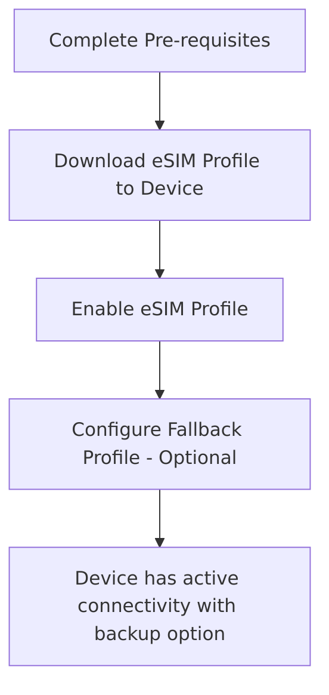
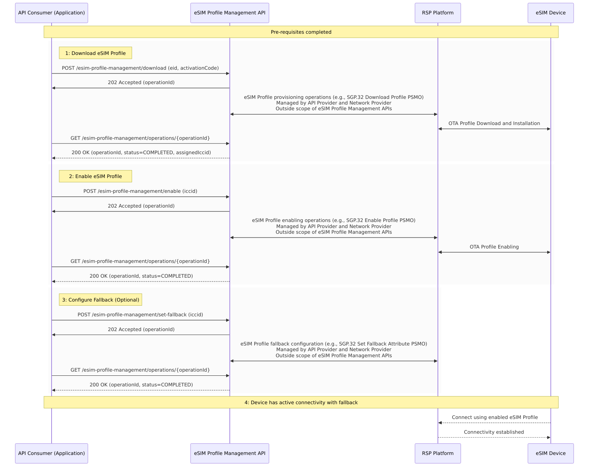
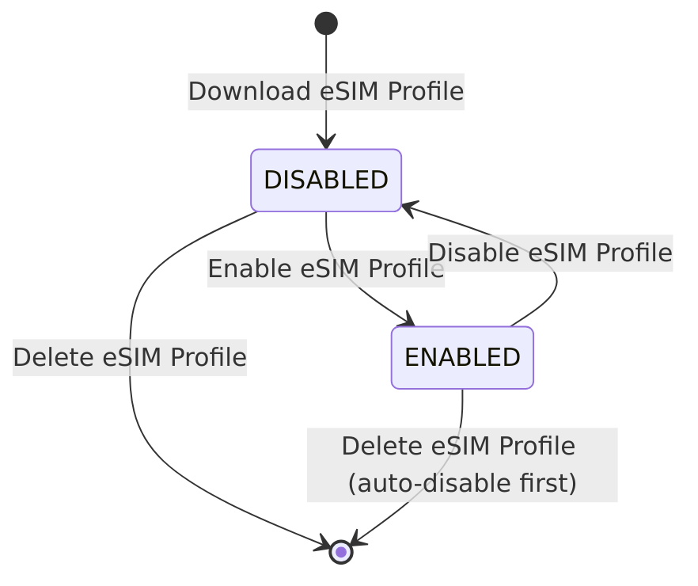
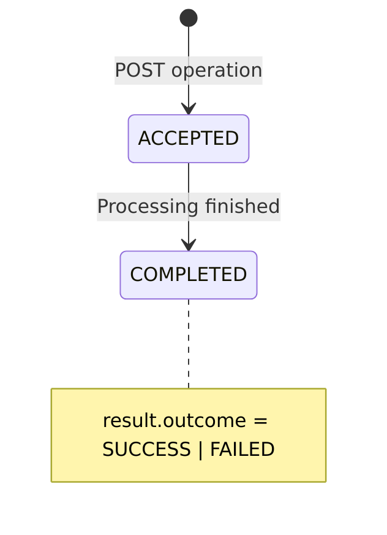

# High level description of eSIM Profile Management concept and API

## Introduction

eSIM (embedded SIM) technology allows remote provisioning and management of cellular connectivity without physical SIM card replacement. The CAMARA eSIM Profile Management API provides a unified interface for eSIM Profile lifecycle operations including download, enable, disable, delete, and fallback configuration.

The target of the eSIM Profile operations is typically the eUICC on the device (as opposed to the cellular network).

**Terminology Note**: In this API, "eSIM Profile" refers to downloadable connectivity configurations installed on eSIM hardware (eUICC). "eSIM" refers to the hardware itself.

**Key roles**

| **Role Name** | **Description** |
| ---- | ------- |
| API Consumer | The entity that consumes the eSIM Profile Management APIs |
| API Provider | The entity that provides the eSIM Profile Management APIs |
| Network Provider | The entity that provides the physical network resources and Remote SIM Provisioning (RSP) platform |
| Device Owner | The entity that owns or manages the devices containing eSIM hardware |

## eSIM Profile Management Operations

The API operations are summarized in the table below:

| **Operation** | **Purpose of the Operation** | **Key Abstractions and concepts** |
| ---- | ------- | ----|
| Download eSIM Profile | Download and install new eSIM Profile to device | An eSIM Profile represents a downloadable connectivity configuration that can be installed on eSIM hardware (eUICC). The download operation combines SGP.32 Profile Download and Installation into a single operation resulting in a DISABLED eSIM Profile ready for enabling. The ICCID is assigned during download and returned in the response. |
| Enable eSIM Profile | Enable an eSIM Profile which is already downloaded on the device | eSIM Profile Enabling makes an installed eSIM Profile active for cellular connectivity (assuming valid connectivity services are configured in the eSIM Profile). Only one eSIM Profile can be enabled per device - enabling an eSIM Profile automatically disables any currently active eSIM Profile. |
| Disable eSIM Profile | Disable active eSIM Profile | eSIM Profile Disabling makes an active eSIM Profile inactive, removing cellular connectivity until another eSIM Profile is enabled. The eSIM Profile remains installed and can be re-enabled. |
| Delete eSIM Profile | Permanently remove eSIM Profile from device | eSIM Profile Deletion permanently removes an eSIM Profile from the device. This operation is irreversible and the eSIM Profile cannot be recovered. The eSIM Profile must be in DISABLED state before deletion. |
| Set Fallback eSIM Profile | Configure backup eSIM Profile | Fallback Configuration designates a backup eSIM Profile that can be automatically activated if the primary eSIM Profile fails or becomes unavailable, ensuring service continuity. |
| Retrieve Status | Query current status of eSIM Profiles on device | eSIM Profile Status provides current state information for all eSIM Profiles on a device, including ENABLED, DISABLED, and fallback eSIM Profile identification. |

All operations that require device interaction (download, enable, disable, delete, set-fallback) are asynchronous, returning a `202 Accepted` with an `operationId` for tracking. Retrieve-status is synchronous and returns `200 OK`.

The status and results of an asynchronous operation are retrieved by polling the GET `/operations/{operationId}` endpoint. Event-based notifications are not supported in this version.

**Figure**: High-level sequence of steps

## Pre-requisites

Before using the eSIM Profile Management API, agreements must be in place between the API Consumer and API Provider covering:

- Service plans and connectivity options
- Geographic coverage areas
- Device compatibility requirements
- Terms and conditions including pricing

This preparation phase is **outside the scope** of the eSIM Profile Management API.

eSIM Profile Management APIs currently do not support procurement of eSIM Profiles and such a capability may be added in future revisions.

## High-level flow

Main steps:

1. **Download eSIM Profile**: Downloads eSIM Profile to device (EID + activationCode required; ICCID assigned during download)
2. **Enable eSIM Profile**: Activates downloaded eSIM Profile for connectivity
3. **Configure Fallback**: Optional backup eSIM Profile for service continuity
4. **Active Connectivity**: Device uses enabled eSIM Profile with optional fallback

## States of eSIM Profiles

eSIM Profiles have two states: DISABLED and ENABLED.

**Figure**: lifecycle of an eSIM Profile

- DISABLED: eSIM Profile installed but not active
- ENABLED: eSIM Profile active and providing connectivity
- Only one eSIM Profile can be enabled per device
- Deletion permanently removes eSIM Profiles

## States of operations

Asynchronous operations have two status values: `ACCEPTED` and `COMPLETED`. The `status` reflects the operation lifecycle only; when an operation reaches `COMPLETED`, the `result.outcome` field carries the final outcome (`SUCCESS` or `FAILED`).

**Figure**: lifecycle of an operation

- `ACCEPTED`: Operation queued for processing
- `COMPLETED`: Operation finished (check `result.outcome` for `SUCCESS` or `FAILED`)

## Device and eSIM Profile Identification

**Identifiers:**
- **eid**: eUICC Identifier (identifies eSIM hardware)
- **iccid**: eSIM Profile Identifier (identifies specific eSIM Profile)

**Usage:**
- Enable/disable/delete/set-fallback require ICCID; EID may also be supplied to scope the operation to a specific eUICC
- Download requires EID (device targeting); the ICCID is assigned during download
- Status retrieval accepts either EID (all profiles on the device) or ICCID (a specific profile)

These are the mandatory identifiers per operation. In addition, a specific implementation may require both the EID and the ICCID to be passed together (e.g. to scope an operation to a particular device), even where only one is mandated above.

For set-fallback in particular, the ICCID identifies the target eSIM Profile to designate as fallback, while the EID, when supplied, identifies the eUICC on which to set it.

When both an EID and an ICCID are provided and each is individually valid, but the ICCID does not correspond to an eSIM Profile installed on the eUICC identified by the EID, the request is rejected with `422 IDENTIFIER_MISMATCH`. Note that `404 IDENTIFIER_NOT_FOUND` is reserved for the case where an identifier cannot be matched at all (e.g. an unknown EID or ICCID), as distinct from a mismatch between two otherwise valid identifiers.

## Operation Status Retrieval

The status and result of an asynchronous operation are retrieved by polling:
- GET /esim-profile-management/operations/{operationId}

Event-based notifications (e.g. CloudEvents callbacks to a sink URL) are not supported in this version.

## Security and Authorization

- OIDC authentication with granular scopes
- Device ownership validation
- Standard CAMARA error responses