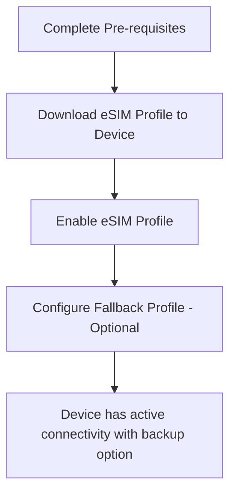
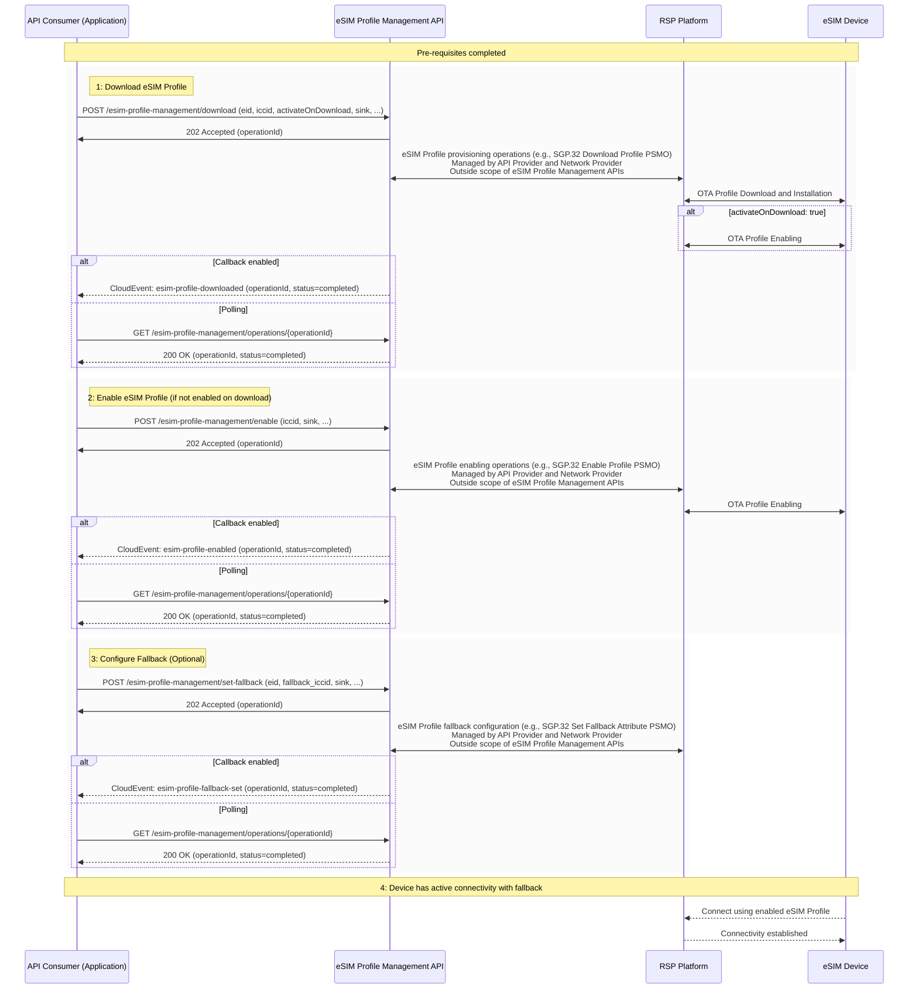
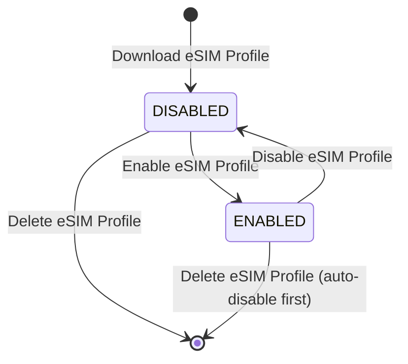
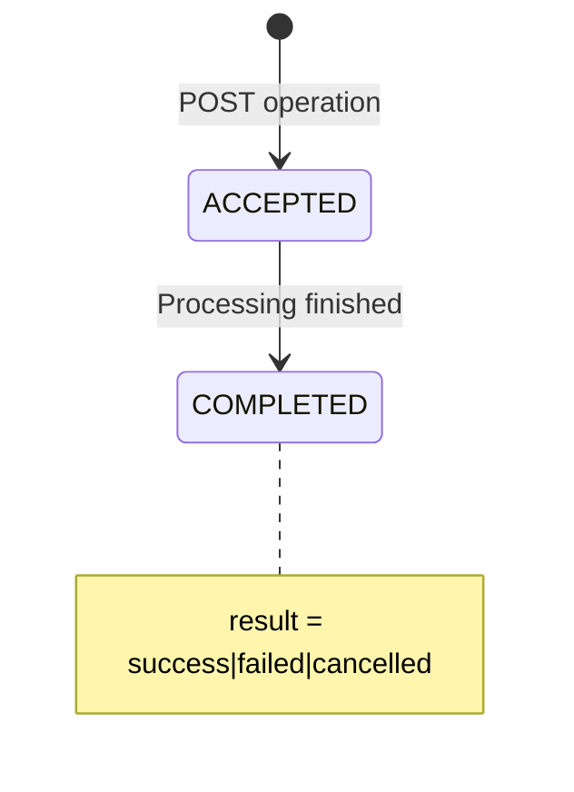

# High level description of eSIM Profile Management concept and API

## Introduction

eSIM (embedded SIM) technology allows remote provisioning and management of cellular connectivity without physical SIM card replacement. The CAMARA eSIM Profile Management API provides a unified interface for eSIM Profile lifecycle operations including download, enable, disable, delete, and fallback configuration.

The target of the eSIM Profile operations is typically the device (as opposed to the cellular network).

**Terminology Note**: In this API, "eSIM Profile" refers to downloadable connectivity configurations installed on eSIM hardware (eUICC). "eSIM" refers to the hardware itself.

**Key roles**

| **Role Name** | **Description** |
| ---- | ------- |
| API Consumer | The entity that consumes the eSIM Profile Management APIs |
| API Provider | The entity that provides the eSIM Profile Management APIs |
| Network Provider | The entity that provides the physical network resources and Remote SIM Provisioning (RSP) platform |
| Device Owner | The entity that owns or manages the devices containing eSIM hardware |

## eSIM Profile Management Operations

The API operations are summarized in the table below:

| **Operation** | **Purpose of the Operation** | **Key Abstractions and concepts** |
| ---- | ------- | ----|
| Download eSIM Profile | Download and install new eSIM Profile to device | An eSIM Profile represents a downloadable connectivity configuration that can be installed on eSIM hardware (eUICC). The download operation combines SGP.32 Profile Download and Installation into a single operation resulting in a DISABLED eSIM Profile ready for enabling. Optional `activateOnDownload` parameter enables immediate enabling after successful download. |
| Enable eSIM Profile | Enable an eSIM Profile which is already downloaded on the device | eSIM Profile Enabling makes an installed eSIM Profile active for cellular connectivity (assuming valid connectivity services are configured in the eSIM Profile). Only one eSIM Profile can be enabled per device - enabling an eSIM Profile automatically disables any currently active eSIM Profile. |
| Disable eSIM Profile | Disable active eSIM Profile | eSIM Profile Disabling makes an active eSIM Profile inactive, removing cellular connectivity until another eSIM Profile is enabled. The eSIM Profile remains installed and can be re-enabled. |
| Delete eSIM Profile | Permanently remove eSIM Profile from device | eSIM Profile Deletion permanently removes an eSIM Profile from the device. This operation is irreversible and the eSIM Profile cannot be recovered. The eSIM Profile must be in DISABLED state before deletion. |
| Set Fallback eSIM Profile | Configure backup eSIM Profile | Fallback Configuration designates a backup eSIM Profile that can be automatically activated if the primary eSIM Profile fails or becomes unavailable, ensuring service continuity. |
| Retrieve Status | Query current status of eSIM Profiles on device | eSIM Profile Status provides current state information for all eSIM Profiles on a device, including ENABLED, DISABLED, and fallback eSIM Profile identification. |

All operations are asynchronous, returning an `operationId` for tracking.

The eSIM Profile Management API provides both callbacks, as well as GET endpoint to query the status and results of eSIM Profile operations.

**Figure**: High-level sequence of steps

## Pre-requisites

Before using the eSIM Profile Management API, agreements must be in place between the API Consumer and API Provider covering:

- Service plans and connectivity options
- Geographic coverage areas
- Device compatibility requirements
- Terms and conditions including pricing

This preparation phase is **outside the scope** of the eSIM Profile Management API.

eSIM Profile Management APIs currently do not support procurement of eSIM Profiles and such a capability may be added in future revisions.

## High-level flow

Main steps:

1. **Download eSIM Profile**: Downloads eSIM Profile to device (EID + ICCID required)
2. **Enable eSIM Profile**: Activates downloaded eSIM Profile for connectivity
3. **Configure Fallback**: Optional backup eSIM Profile for service continuity
4. **Active Connectivity**: Device uses enabled eSIM Profile with optional fallback

## States of eSIM Profiles

eSIM Profiles have two states: DISABLED and ENABLED.

**Figure**: lifecycle of an eSIM Profile

- DISABLED: eSIM Profile installed but not active
- ENABLED: eSIM Profile active and providing connectivity
- Only one eSIM Profile can be enabled per device
- Deletion permanently removes eSIM Profiles

## States of operations

Operations are asynchronous with two status states: ACCEPTED and COMPLETED. Operation results (success, failed, cancelled) are separate from status.

**Figure**: lifecycle of an operation

- ACCEPTED: Operation queued for processing
- COMPLETED: Operation finished (check result for outcome)

## Device and eSIM Profile Identification

**Identifiers:**
- **eid**: eUICC Identifier (identifies eSIM hardware)
- **iccid**: eSIM Profile Identifier (identifies specific eSIM Profile)

**Usage:**
- Most eSIM Profile operations require ICCID
- Download/set-fallback additionally require EID (device targeting)
- Status retrieval may accept any identifier

## Event Notifications

CloudEvents-based notifications for operation status:
- Callbacks to provided sink URL
- Polling via GET /esim-profile-management/operations/{operationId}

## Security and Authorization

- OIDC authentication with granular scopes
- Device ownership validation
- Standard CAMARA error responses